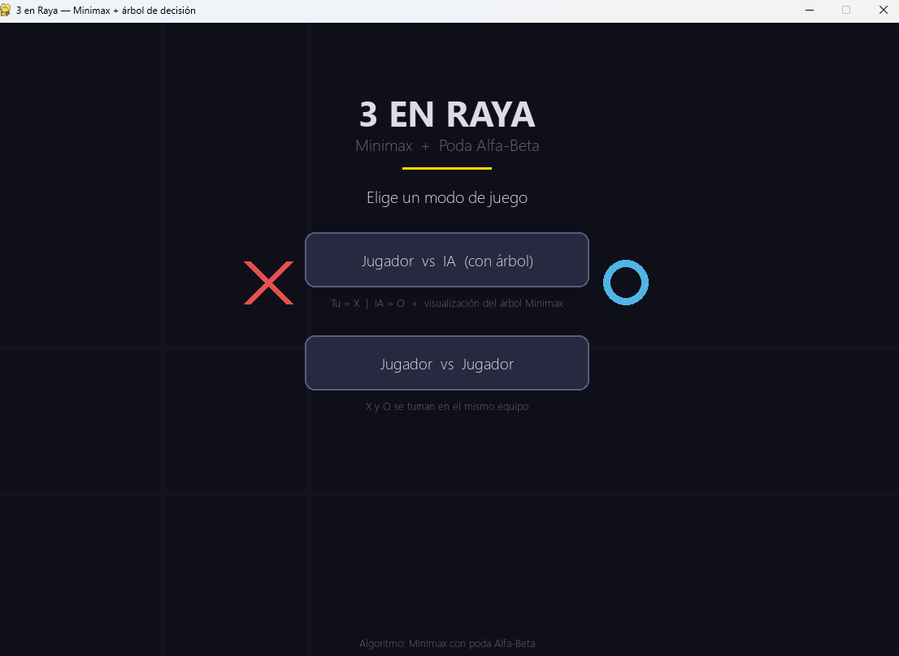
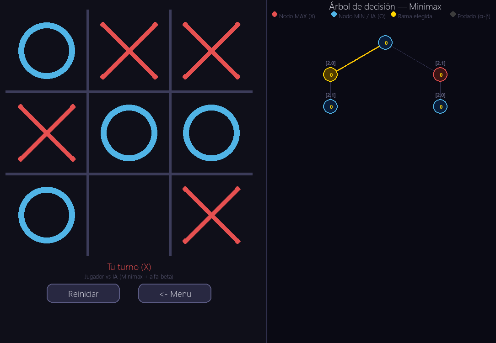
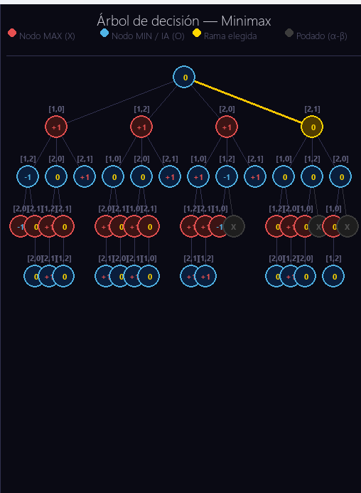
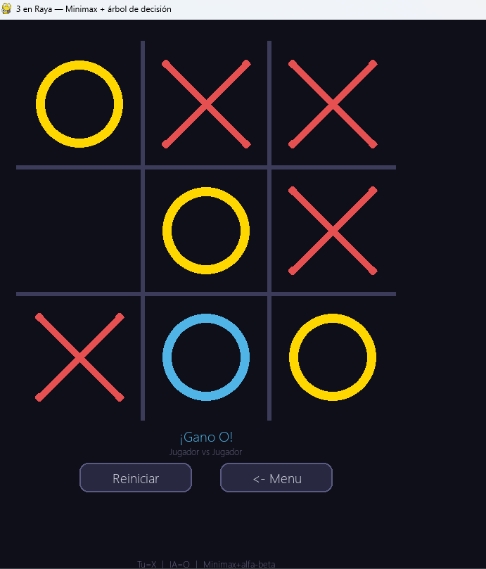

#  3 en Raya — Minimax + Poda Alfa-Beta

> Implementación del juego clásico de **3 en Raya (Tic Tac Toe)** con IA basada en el algoritmo **Minimax** optimizado con **Poda Alfa-Beta**, desarrollado en Python con Pygame.
> El objetivo principal es visualizar en tiempo real el árbol de decisiones que genera la IA en cada movimiento.

---

## Capturas del proyecto

### Menú principal
> Pantalla inicial donde se elige el modo de juego.



---

### Modo Jugador vs IA
> El jugador (X) compite contra la IA (O) controlada por Minimax. La IA nunca pierde.



---

### Visualización del árbol de decisiones
> Panel derecho generado en tiempo real durante el movimiento de la IA. Muestra nodos MAX y MIN, ramas elegidas, nodos podados y valores de utilidad.



---

### Modo Jugador vs Jugador
> Modo local para dos jugadores humanos turnándose en el mismo equipo.



---

## Características

- Interfaz gráfica moderna e interactiva con **Pygame**
- **Modo Jugador vs IA** — la IA es imbatible gracias a Minimax
- **Modo Jugador vs Jugador** — partidas locales entre dos personas
- Visualización gráfica del **árbol de decisiones Minimax** en tiempo real
- Resaltado de la **rama elegida** por la IA (color dorado)
- Nodos **podados por Alfa-Beta** claramente diferenciados
- Scroll en el panel del árbol con rueda del ratón o teclas ↑↓

---

## 🧠 Algoritmos implementados

### Definición formal del juego

| Función | Descripción |
|---|---|
| `S0` | Estado inicial: tablero vacío, turno de MAX (X) |
| `PLAYER(s)` | Devuelve a qué jugador le toca en el estado `s` |
| `ACTIONS(s)` | Lista de movimientos legales (celdas vacías) |
| `RESULT(s, a)` | Estado resultante de aplicar la acción `a` en `s` |
| `TERMINAL(s)` | `True` si el estado `s` es terminal (victoria o empate) |
| `UTILITY(s)` | Valor numérico del estado terminal (`+1`, `-1`, `0`) |

### Minimax

```
MAX elige a en ACTIONS(s) → mayor  MIN_VALUE(RESULT(s, a))
MIN elige a en ACTIONS(s) → menor  MAX_VALUE(RESULT(s, a))
```

### Poda Alfa-Beta

Optimización que elimina ramas que no pueden influir en la decisión final:

```python
# Poda Beta (en MAX_VALUE)
if v >= beta:
    return v   # MIN nunca elegiría este camino → cortar

# Poda Alfa (en MIN_VALUE)
if v <= alfa:
    return v   # MAX nunca elegiría este camino → cortar
```

### Visualización del árbol

| Elemento | Significado |
|---|---|
| 🔴 Nodo rojo | Nodo **MAX** — turno del jugador (X) |
| 🔵 Nodo azul | Nodo **MIN** — turno de la IA (O) |
| 🟡 Nodo dorado | **Rama elegida** por la IA |
| ⚫ Nodo gris `✕` | Nodo **podado** por Alfa-Beta |
| `+1 / -1 / 0` | Valor **UTILITY** calculado |
| `[fila, col]` | Acción (celda) que llevó a ese nodo |
| Línea dorada | Camino de la decisión final |

> El árbol muestra hasta **4 niveles de profundidad**. Los niveles más profundos se evalúan internamente sin visualización para mantener el rendimiento. La IA sigue siendo perfecta.

---

##  Tecnologías utilizadas

- **Pygame** — renderizado gráfico y manejo de eventos

---

##  Ejecución

**1. Instalar dependencias:**
```bash
pip install pygame
```

**2. Ejecutar el proyecto:**
```bash
python main.py
```

---

##  Controles

| Acción | Control |
|---|---|
| Colocar ficha | Clic izquierdo en la celda |
| Reiniciar partida | Botón **Reiniciar** |
| Volver al menú | Botón **← Menú** |

---

##  Objetivo educativo

Este proyecto fue desarrollado con fines educativos para comprender:

- Inteligencia Artificial aplicada a juegos
- Árboles de búsqueda y espacio de estados
- Algoritmo **Minimax**
- Optimización con **Poda Alfa-Beta**
- Evaluación de estados terminales
- Desarrollo visual interactivo con **Pygame**
